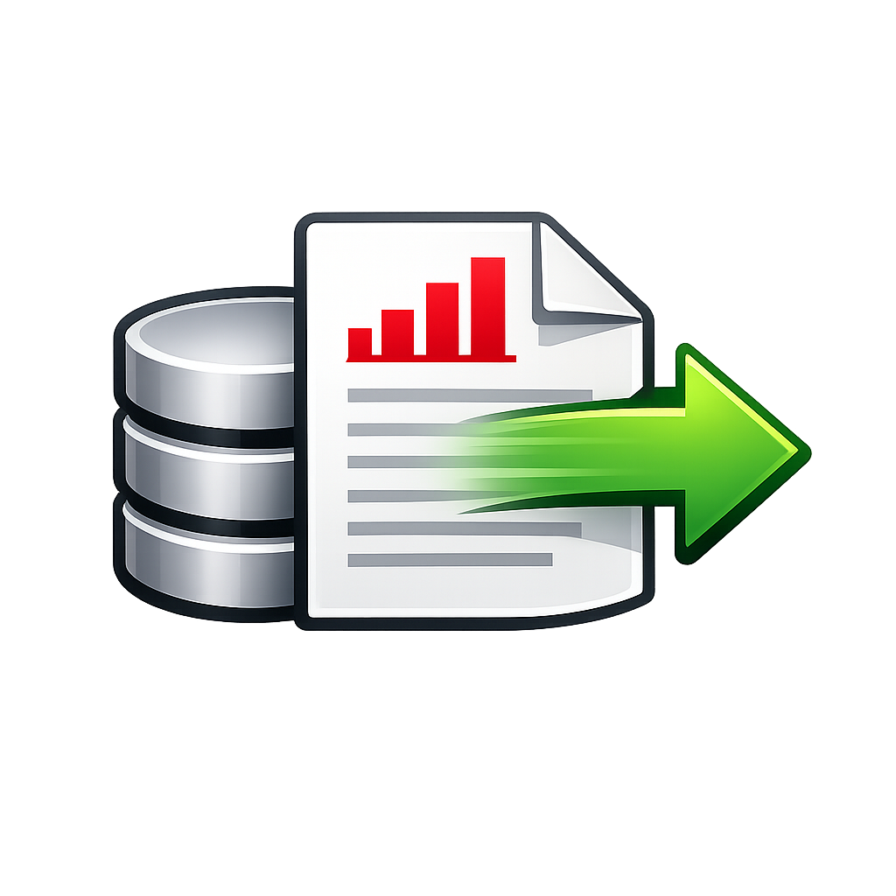

# zotexport



`zotexport` is an Electron desktop app that reads a local Zotero data directory in read-only mode and exports a selected collection subtree to a ZIP file.

## Features

- Detects the Zotero profile and local data directory automatically.
- Reads `zotero.sqlite` with a bundled SQLite runtime, so the packaged app does not depend on a system `sqlite3` installation.
- Rebuilds the full library, collection, and subcollection tree.
- Lets you export one selected collection or subcollection together with all of its descendants.
- Creates ZIP folders only for collections and subcollections.
- Includes only `.pdf`, `.epub`, `.doc`, `.docx`, `.md`, and `.markdown` attachments.
- Shows live progress and a completion summary.

## Safety model

The app does not modify Zotero.

- It never writes to the Zotero database.
- It never deletes files.
- It never creates files inside Zotero directories.
- It only reads from `zotero.sqlite` and `storage/`.
- It writes only the ZIP file you choose.

## Requirements

- Node.js 20 or newer
- npm 10 or newer
- A local Zotero data directory with `zotero.sqlite` and `storage/`

For development tests, the suite currently uses `sqlite3` and `unzip` from your system `PATH` to create temporary fixtures and inspect generated ZIP files.

## Install dependencies

```bash
npm install
```

## Startup modes

1. Development run: `npm start`
2. Development alias: `npm run dev`
3. Packaged macOS app: open the generated DMG from `dist/`, install `zotexport.app`, then launch it from Applications
4. Packaged Windows app: run the generated installer `.exe` from `dist/`, complete the installation, then launch `zotexport`

## Zotero data initialization order

When the app starts or refreshes, it looks for the Zotero data directory in this order:

1. A directory chosen manually from the app with `Choose data directory`
2. The Zotero profile preference `extensions.zotero.dataDir` when `extensions.zotero.useDataDir=true`
3. The default Zotero data directory, typically `~/Zotero`
4. The Zotero profile root itself if it already contains `storage/` and a valid Zotero database

## How to use the app

1. Launch `zotexport`.
2. Wait for the detected libraries and collections to load.
3. If the detected source is wrong, click `Choose data directory` and select the folder that contains `zotero.sqlite` and `storage/`.
4. Select a collection or subcollection in the tree.
5. Click `Export ZIP`.
6. Choose the output path.
7. Wait until the progress bar reaches 100%.
8. Open the generated ZIP file.

## Development commands

```bash
npm test
npm run build:mac
npm run build:win
npm run build
```

## Build outputs

- macOS installer: `dist/*.dmg`
- Windows installer: `dist/*.exe`

## Official Zotero documentation used

- Direct Access to the Zotero SQLite Database: https://www.zotero.org/support/dev/client_coding/direct_sqlite_database_access
- Profile Directory: https://www.zotero.org/support/kb/profile_directory